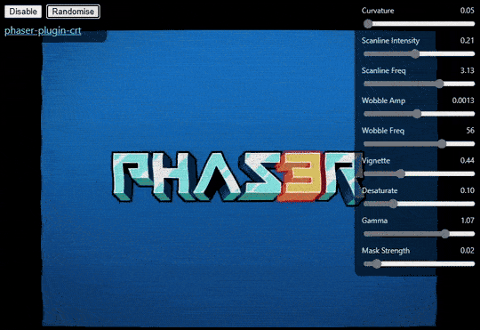

# phaser-plugin-crt

A lightweight **CRT** post-processing effect for **Phaser 3** as a **Scene Plugin**.
WebGL-only; safely no-ops on Canvas.



## Installation

```bash
npm install phaser-plugin-crt
```

## Usage

Import and register as a Scene Plugin:

```ts
import Phaser from "phaser";
import { CRTPlugin } from "phaser-plugin-crt";

const config: Phaser.Types.Core.GameConfig = {
  type: Phaser.AUTO,
  plugins: {
    scene: [{ key: "CRTPlugin", plugin: CRTPlugin, mapping: "crt" }],
  },
  scene: [MyScene],
};

new Phaser.Game(config);
```

In your scene, simply call crt.enable with your options:

```ts
export class MyScene extends Phaser.Scene {
  create() {
    // Enable for all cameras
    this.crt.enable({
      curvature: 0.18,
      scanlineIntensity: 0.16,
      wobbleAmp: 0.001,
    });

    // Toggle with a key
    const key = this.input.keyboard?.addKey("P");
    key?.on("down", () => this.crt.toggle());

    // Live tweak
    this.time.addEvent({
      delay: 2000,
      loop: true,
      callback: () => this.crt.update({ wobbleAmp: Math.random() * 0.002 }),
    });

    // Disable for all cameras
    this.crt.disable();
  }
}
```

### Options

- `curvature` (0–0.4)
- `scanlineIntensity` (0–0.5)
- `scanlineFreq` (1.5–4.0)
- `wobbleAmp` (0–0.003)
- `wobbleFreq` (10–80)
- `vignette` (0–1)
- `desaturate` (0–1)
- `gamma` (0.8–1.2)
- `maskStrength` (0–0.1)
- `noise` (0–0.3)

## Demo

Open `demo/index.html` locally or serve the folder.

## Build

```bash
npm i
npm run build
```

Run `npm test` to execute the minimal runtime smoke tests.

## License

MIT © Spikything.com
